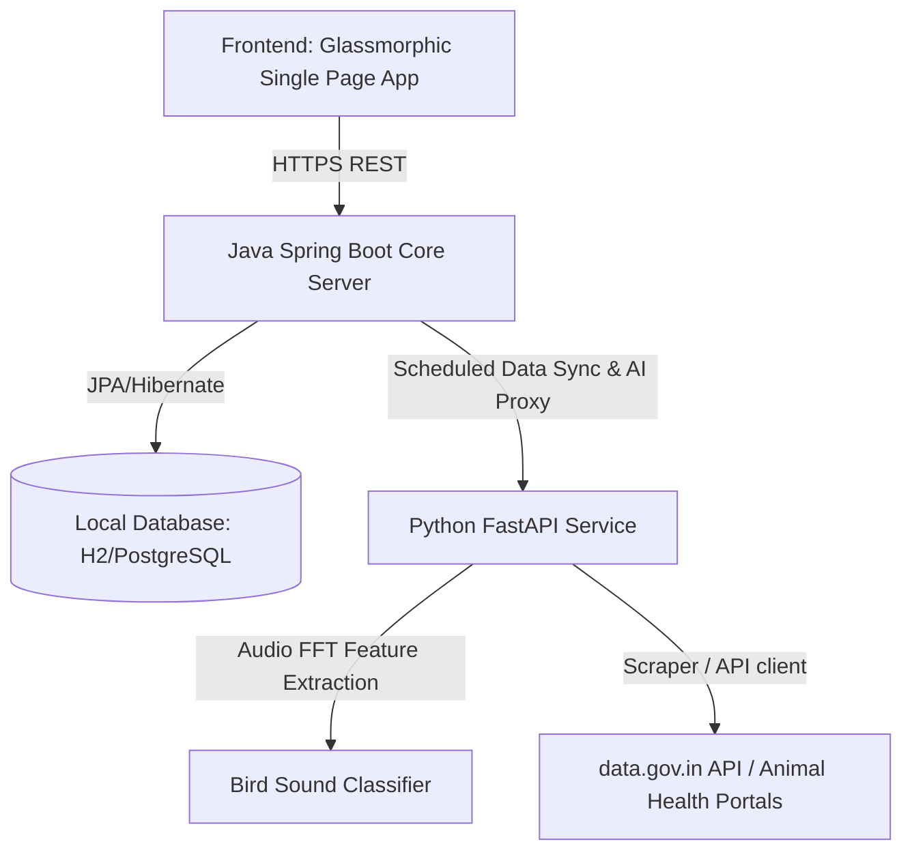

# GramSetu: Farmer Data Bridge (India)

GramSetu is a modern data ecosystem tailored for Indian farmers, serving as a unified portal for grain market rates, cattle disease alerts, regional vaccinations, and citizen-science bird sound identification.

---

## 🌟 Features

1. **Cattle Disease Outbreak Mapping**: An interactive geospatial heat-intensity map of livestock outbreaks (Lumpy Skin Disease, Foot & Mouth Disease, Brucellosis, etc.) across various Indian states using Leaflet.js.
2. **Bovine Vaccination Advisory**: Shows instant region-specific immunization directions and vaccine availability targets depending on which outbreaks are reported nearby.
3. **Mandi Market Rates**: Real-time mandi commodity rate listings (Wheat, Paddy, Barley, Mustard, etc.) per quintal across states, searchable by district or market. Supports offline fallback simulator when Open Government Data (`data.gov.in`) APIs are rate-limited.
4. **AI-Powered Bird Acoustics Classifier**: A record-and-analyze micro-interaction that logs bird audio, matches spectral centroid & pitch signatures against target Indian bird acoustic templates (like Jerdon's Courser, Forest Owlet, Great Indian Bustard, and Asian Koel), and pins sightings to survey populations in the wild.
5. **Scheduler Synchronization**: Weekly automated fetches for grain prices and monthly checks for animal epidemics.

---

## 🏗️ Architecture



---

## 🚀 How to Run Locally

### 1. Python AI Service
Requirements: Python 3.8+ with sound card libraries.
```bash
cd service-python
pip install -r requirements.txt
python main.py
```
This runs the FastAPI gateway on `http://127.0.0.1:8000`.

### 2. Java Spring Boot Core Service
Requirements: JDK 17 & Maven.
```bash
cd backend-java
mvn clean spring-boot:run
```
This boots up the primary Java core server on `http://localhost:8080`.

Open your browser and navigate to `http://localhost:8080` to experience the GramSetu platform.

---

## 🌎 Production Deployment (Render)

GramSetu is configured for deployment on Render. Use the included `render.yaml` Blueprint file to create the entire stack:
- Submits both containers via multi-stage Docker builds.
- Automatically handles dependencies like `libsndfile` and `ffmpeg` in Python for audio wave analysis.
